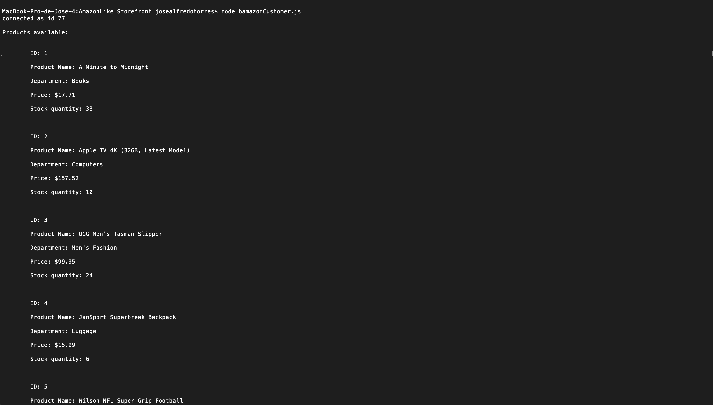
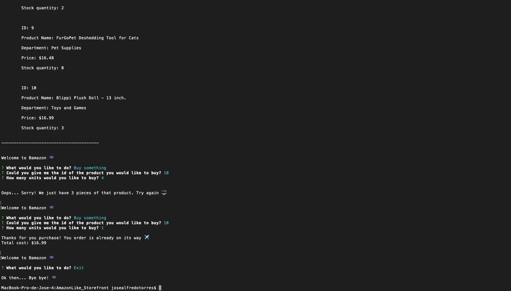

# AmazonLike_Storefront (Bamazon)

Bamazon is an Amazon-like storefront that works using MySQL and Node.js. The app is divided in 3 parts: Costumer side operation, Manager view and Supervisor View.

Customer's View will first display all the items available for sale and its characteristics (ID, Name, Department Name, Price and Stock Quantity).

Then it will ask for what would you like to do: Buy or exit the application. 

If you select the "Buy" option, it will ask you for the product ID and how many items of this product would you like to buy.

If there are enough items to fullfill your request, the data base will be updated to reflect the remaining quantity and the total cost of your order will be displayed. If not it will display and error message and then prevent the order from going through.

In order to use the program, first you need to clone it from Github to somewhere in your computer.
Then, inside the root folder of 'AmazonLike_Storefront', create a .env file with:

    MYSQL_PASSWORD=Your_MySQL_Password

After that you will need to open the 'terminal' and write '$ npm install' to download the required packages.

Once that you are all set, you can start using the program.

To start the program you will need to type this lines in the terminal:

- Customer View: 
    node bamazonCustomer.js

Customer View:

Required technologies:
MySQL
Node.js
Javascript
Visual Studio Code